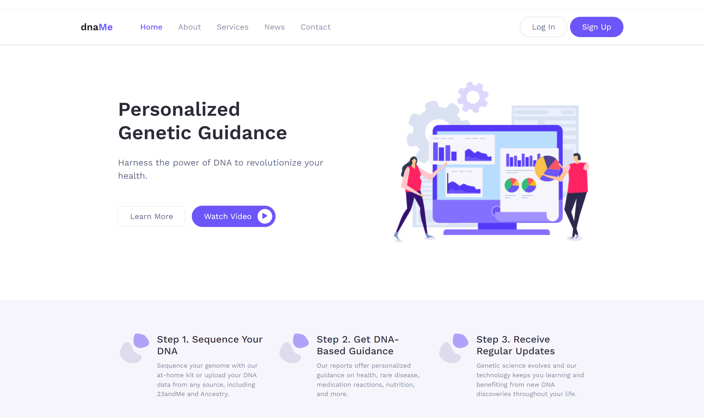

# dnaMe 🧬🔬🥼

## Description
Introducing dnaMe, my passion project — an innovative app empowering users to gain deeper insights into their health. The platform currently specializes in the analysis of genetic predisposition to Alzheimer's disease, allowing users to upload raw DNA data from providers like 23andMe and Ancestry for personalized risk assessments.

While dnaMe currently only performs risk analysis of Alzheimer's disease, my future plans, as evidenced by the app's landing page, include broadening the scope to cover a multitude of diseases. Stay tuned for exciting updates as I attempt to redefine healthcare through personalized DNA analysis! 🤓

## Preview

  
<h2 style="font-weight: semi-bold;">How does dnaMe determine genetic predisposition to Alzheimer's disease?</h2>

  Before delving into how dnaMe determines genetic predisposition, it's important to understand a few biology concepts.

  ### ✂️ SNP (Single Nucleotide Polymorphism)
  A SNP is a variation at a single position in the DNA sequence that occurs when a single nucleotide (A, T, C, or G) is replaced by another. SNPs influence traits, diseases, and responses to medications.

  ### 📖 rsID (Reference SNP IDentifier)
  An rsID is a unique identifier assigned to a specific SNP, aiding researchers in tracking genetic variations. For example, rs429358 and rs7412 are rsIDs for SNPs in the APOE gene.

  ### 🧬 Allele & Genotype
  An allele is a variant form of a gene; a genotype is the combination of two alleles (you inherit one allele from each parent). In the context of a SNP, the alleles refer to the nucleotides at the specific position. For example, in the SNP rs429358, the two alleles could be T&T, C&T, or C&C. Thus, the genotype is either TT, CT, or CC, respectively.

  ### 🧬 Apolipoprotein E (APOE) gene
  The APOE gene provides instructions for producing apolipoprotein E, a protein involved in lipid metabolism. Variations in the APOE gene, determined by SNPs rs429358 and rs7412, influence protein function and therefore risk of various health conditions, including Alzheimer's disease.

  In the APOE genotype, the ε4 allele is considered a risk factor for Alzheimer's, while ε2 is associated with lowered risk.

  ### APOE Genotypes and Alzheimer's Risk
  | rs429358 Genotype | rs7412 Genotype | APOE Genotype | Alzheimer's Risk         |
  |-------------------|------------------|-------------|---------------------------|
  | TT                | CC               | ε2/ε2       | Lower risk than normal    |
  | CT                | CT               | ε2/ε3       | Lower risk than normal    |
  | TT                | CC               | ε2/ε4       | Slightly higher risk      |
  | CC                | CC               | ε3/ε3       | Normal risk               |
  | CT                | CC               | ε3/ε4       | Higher risk than normal   |
  | CC                | CC               | ε4/ε4       | High risk                 |

  ### The App
  1. Given a raw DNA file, which contains hundreds of thousands of rsIDs, dnaMe extracts the genotypes of two SNPs, rs429358 and rs7412.
  2. The app uses this information to determine the alleles that make up one's APOE gene, which can be any combination of ε2, ε3, and ε4.
  3. Lastly, the app takes the APOE gene and determines the genetic predisposition to Alzheimer's disease.

## Features
- **User Authentication**: Implements Passport.js for secure authentication.
- **Data Management**: Securely upload DNA data for analysis.
- **Data Analysis**: Reviews over 630,000 lines of data per DNA file, extracting only two pieces of information, rs429358 genotype and rs7412 genotype.
- **Data Interpretation**: Performs in-depth DNA analysis, providing information on APOE genotype and Alzheimer's risk.
- **Different Accounts and UIs**:
  - User account: For individuals seeking to analyze their genetic information and receive personalized guidance.
  - Counselor account: For genetic counselors who provide support and counseling services to users.
- **Appointment Booking System**: Counselors establish their working hours, which are automatically converted to hour-long appointments. Users can book these appointments and get genetic counseling.

## Tech Used
- **Frontend**: HTML, CSS, Bootstrap, JavaScript, EJS, AJAX
- **Backend**: Node.js, Express.js
- **Database**: MongoDB, Mongoose ODM, Connect-Mongo
- **Middleware**: Passport.js, Multer, Morgan, bcrypt
- **Other libraries**: FullCalendar, line-by-line

## Sources
- [23andMe](https://www.23andme.com/topics/health-predispositions/late-onset-alzheimers/?_gl=1*123e4o4*_ga*MTc3ODAyNTUyMS4xNzA4MzI1Mjk2*_ga_G330GF3ZFF*MTcwODMyNTI5Ni4xLjAuMTcwODMyNTI5Ni4wLjAuMA..)
- [Testing.com](https://www.testing.com/tests/apoe-genotyping-alzheimer-disease/)
- [Labcorp](https://www.labcorp.com/tests/504040/i-apoe-i-alzheimer-s-risk)